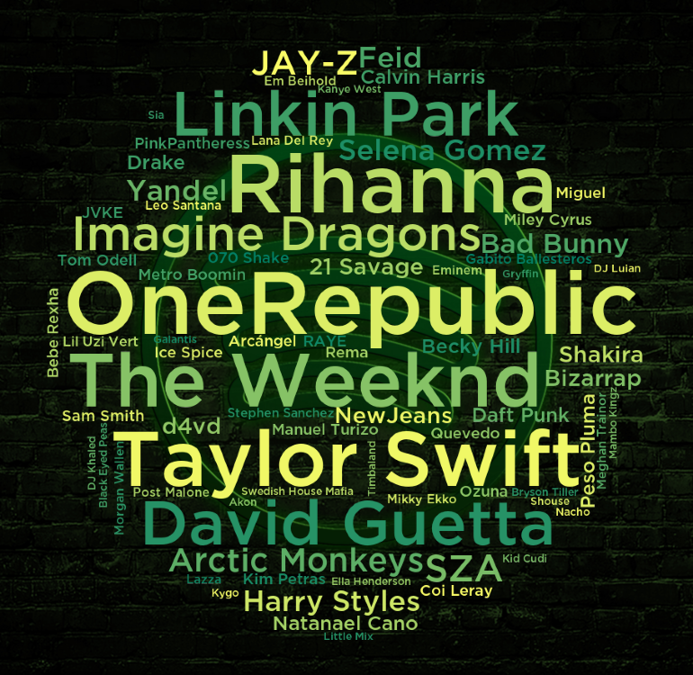

# Spotify-Playlist-Wordcloud
A word cloud is a visual representation of text data that displays the most frequently occurring words in a given text, with the size of each word proportional to its frequency. Typically, the words are displayed in random order and different colors, and the goal is to provide a quick and easy way to identify the most prominent themes or topics within a larger body of text. Word clouds are often used in data visualization and analysis, particularly in fields such as marketing, social media, and text mining, as they can help to identify patterns and trends in large volumes of unstructured text data. In this case, we want to create a word cloud from the artists that appear on a certain playlist on spotfy

This an example for the following Playlist:
https://open.spotify.com/playlist/0xBYY3VdyBcvqT9i4PLuQX?si=e0174e79f788451b

# Installation
At first download the spotify font and save it under "Spotify-Font.otf" in the same folder as the "spotify.py".
